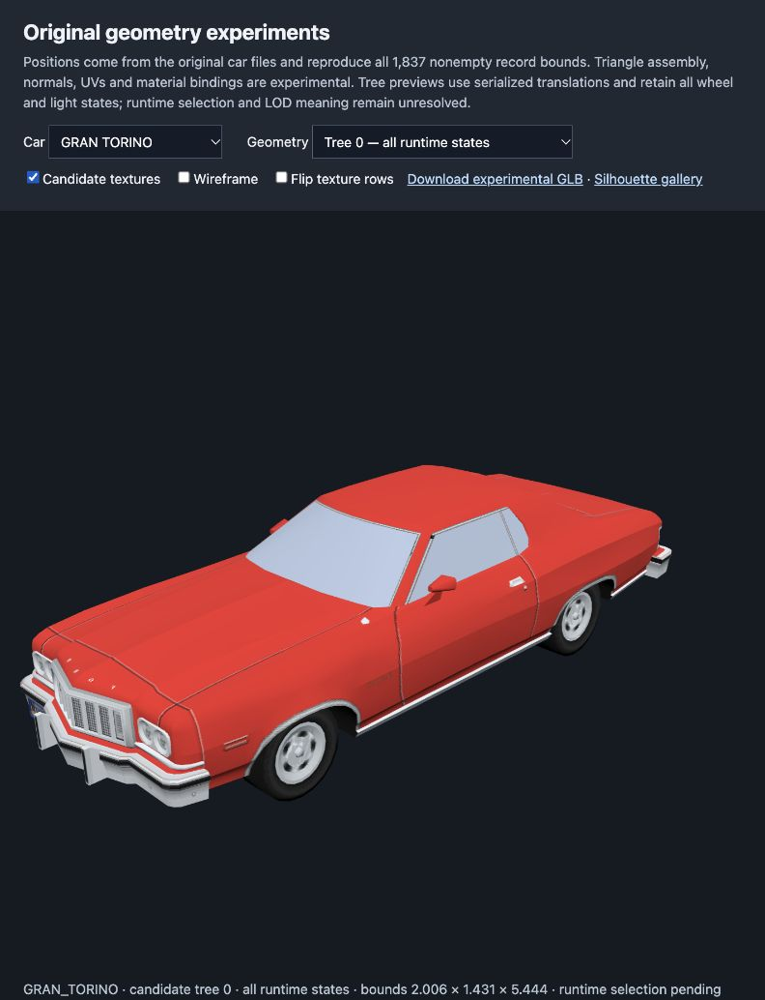
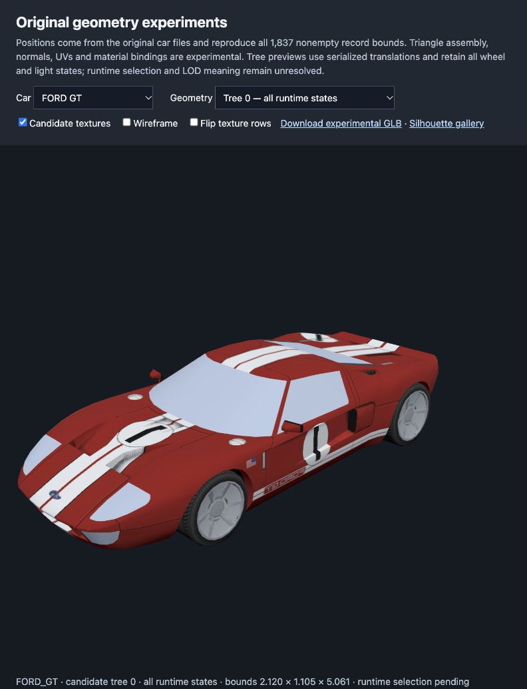

# Original Ford Racing 2 car recovery

Research and experiments completed 2026-10-04 against the existing PAL `SLES-51705` corpus in `/Users/Nicolas/Documents/github/hermes/reverse-engineering`. This pass used Jev and TypeSafe judgments to screen, retrieve, compare and review evidence. It also commissioned the requested two community researchers: GitHub/Stack Overflow and Reddit/YouTube transcripts. All new recovery outputs are in this carmodels project; the source reverse-engineering project was read without intentional edits.

## Outcome

Original car position data is in the individual `.PS2;1` files. The old shared-pool explanation is superseded. The existing loader-derived texture decoder can recover embedded model images, and this pass exports 700 level-zero textures plus 35 experimental textured GLBs. Serialized translation trees now place wheels with bodies. The inspector is running at <http://127.0.0.1:58218/recovered.html> for this session and is saved as [viewer/recovered.html](../viewer/recovered.html).

The GLBs now expose 134 complete numeric texture variants through `KHR_materials_variants`, sourced from 136 referenced variant groups. Original EE remapping words agree with 852 host probes and six car/selector pairs in each of two captures; those are 12 entity-capture checks, not 12 distinct liveries. Independent source-file walks validate all 42,480 exported mapping entries. The stock Taurus first entries are 8×8 placeholders; selecting a recovered nonzero variant exposes its full-size racing livery. [Selector contract](evidence/continuation/source-refresh/texture-variant-contract.json), [independent review](evidence/continuation/source-refresh/texture-variant-independent-review.json), [export validation](evidence/continuation/source-refresh/texture-variant-export-validation.json).
All 12,080 original material headers are now preserved in the GLB primitive metadata, including 1,096 explicit base-color words and 242 headers with stored alpha below 128. The original packed color is AARRGGBB; raw PEXTLB/PEXTLH/PEXEW instructions and pinned PCSX2 MMI semantics establish the RGBA lane order. Raw EE COP2 vector destination masks expose a decompiler omission: header flag `0x1` scales XYZ, while its clear branch scales W. These source recipes are retained without claiming a final glTF blend. All 12,080 exported headers pass an independent source-byte/field validator, and changed original alpha, missing headers, and duplicated headers are rejected. [Material contract](evidence/continuation/source-refresh/material-header-contract.json), [material preservation validation](evidence/continuation/source-refresh/material-header-export-validation.json).


The continuation has recovered all 94 stored extra mip levels, joined all source-named trees, and validated the 35 current GLBs with Khronos and Blender. It decoded all 171 CARS/LIVERY PTGs and discovered a further 136 MATRIX car-variant PTGs, now archive-bound and decoded with the source-derived indexed-palette contract. Two shipped thumbnail databases supply 184 original cached streams and filenames; their reconstructed JPEG previews are qualified references, not exact-pixel evidence. Original gameplay captures join six cars and 378 hierarchy nodes, including 144 nonzero mutable rotations and changing wheel-state bits. COBRA source UVs and a base texture are joined to executed GS packets. Full rendering fidelity remains open: exact VU selection/color generation, added ADC suppression, material branches, glass/reflections, and observed UI blending still need closure. The live matrix below records those limits.





The [canonical per-car recovery index](../recovered/index.json) now links 2,579 hash-verified files for all 35 roster cars. Each car has a manifest under `recovered/cars/<CAR>/manifest.json`. The index excludes diagnostic palette controls and approximate cache previews. [Independent ownership/file-set/hash audit](evidence/continuation/source-refresh/recovered-asset-index-validation.json). The verifier now rejects rehashed cross-car model swaps and altered schema/fidelity/status/limit declarations, as well as corrupt hashes; rendering completion is explicitly false in every manifest.

## Corpus and provenance

The [fresh census](evidence/original-recovery/car-asset-census.json) compares each car file both to its per-car manifest hash and to the same file loaded from the original `FILES.HDR`/`FILES.DAT` archive. The baseline identity is `fr2-pal-sles-517.05`, corpus ID `e69a2afbd6db606d166e40bae32c436691e134722ad153200859961a5f517dab`. Executable SHA-256 is `216711210898aee296eed73d0776e7f733bac04c334002683bce769c86beea95`. The census pins five parser/contract modules by SHA-256 and retains texture and geometry offsets.

| Measured scope | Result |
|---|---:|
| Archive-matched car models / exact EOF walks | 35 / 35 |
| Geometry records / nonempty records | 1,872 / 1,837 |
| Geometry headers / signed16 XYZ samples | 12,080 / 657,139 |
| Embedded level-zero model textures | 700 |
| Format 1 / format 3 / format 4 textures | 78 / 618 / 4 |
| Raw-alpha plus display-alpha PNG files | 1,400 |
| Stored extra car mip levels, exported in continuation | 94 |
| Experimental GLBs / translated trees retained | 35 / 175 |
| Candidate triangles across independent records | 387,530 |
| Separate menu icons / livery PTGs | 35 / 136 |
| Additional MATRIX car-variant PTGs | 136 |
| Original cached thumbnail streams | 184 |
| Complete numeric texture variants / referenced variant groups | 134 / 136 |

The 35-car subset must not be confused with the wider 56-model corpus, which has 2,370 embedded images and non-car assets. The fresh [56-file bound audit](evidence/original-recovery/full-geometry-check/20261004T203944Z-f8b8101687f140d0a6260de71e695722/result.json) passes: all files reach EOF, all 96,444 bound words are finite, and no pair is inverted. Its 54 loader68 / two measured legacy60 profiles do not prove the current executable consumes both profiles.

## Local position recovery

The geometry table uses 52-byte records with separate group counts at `+0x1c` and `+0x28`, not adjacent halfwords. Bounds are three min/max pairs at `+4/+8`, `+12/+16`, `+20/+24`. Geometry headers lead to aligned six-byte, four-byte and optional additional planes. The existing [section parser](../../../reverse-engineering/tools/ps2_sections.py) supplies these boundaries.

The six-byte samples decode as signed little-endian int16 XYZ. For each axis of each record:

```
extent = max(abs(stored_min), abs(stored_max))
position = signed16 * extent / 16384
```

This matches every nonempty car record's extrema on all three axes within `extent/16384 + 1e-6`: **1,837 / 1,837**. An independent research script agrees, measuring 11,022 endpoint comparisons with maximum residual 0.9998 quantization steps and mean residual 0.2467 steps. The result is unusually specific: the exporter preserves local per-record scale; one global mesh scale is insufficient. [Parent experiment](evidence/original-recovery/per-record-scale-experiment.json), [independent script](evidence/original-recovery/geometry-experiment/run_geometry_experiment.py), [independent results](evidence/original-recovery/geometry-experiment/results.json).

| Same per-record maxabs mapping, divisor | Records matching both endpoints on all axes |
|---|---:|
| 8,192 | 0 |
| 16,384 | 1,837 |
| 32,768 | 0 |
| 65,536 | 0 |

Independent alternatives also tested centered half-extent formulas and fixed/global fits. `center + raw/32767*half_extent` matches zero records within its tolerance; `center + raw/16384*half_extent` matches 383. A pooled affine fit has low R² by axis (0.47, 0.52, 0.39). Merely enclosing a record is a weaker check than reproducing its endpoints.

Source tracing corroborates the arithmetic. `FUN_001288b0` loads the bound endpoints, uses COP1 `abs.S` / `max.S`, and builds a maxabs XYZ plus 1.0 qword. `FUN_00128e88` places that vector in header qword four and emits STROW 768 then STMOD 1 before V3-16. Overlay five loads qword four into **vf20**, subtracts 768 from the position input, multiplies by vf20 and continues through further transforms. Overlay six stores output qwords and executes `XGKICK vi11`. The exact identity

```
reinterpret_float32(0x44400000 + sign_extended_s16) - 768 == s16 / 16384
```

holds with zero measured error for all 1,971,417 component words. The [ELF byte check](evidence/original-recovery/geometry-source-byte-check.json) checks 154 original instruction words against the saved static export and ELF PT_LOAD mapping with no failures. The [geometry researcher report](original-geometry-research.md) links the producer, VIF and VU primary evidence. These static checks do not observe initial runtime VIF state, DMA scheduling or hardware output.

## Topology and attribute experiments

The four-byte plane is informative. Signed XYZ vector lengths round to 126 or 127 for 656,687 of 657,139 samples; 335 round to 125 and 117 are zero. Unit-normalizing those XYZ vectors gives usable candidate normals. The fourth byte W is always 0 or 1: 387,530 zero, 269,609 one. All 12,080 headers start with two W=1 samples. The traced VU path loads a W lane, adds `0x7fff` and stores it in the ADC-related output position. [W measurements](evidence/original-recovery/four-byte-w-experiment.json), [attribute measurements](evidence/original-recovery/packed-attribute-experiment.json).

The exporter walks a sequential triangle strip, alternates winding and suppresses a triangle when the current W is 1, while advancing the strip window. Across all records this produces 387,530 triangles and no repeated-position degenerate triangles. It suppresses 245,449 later samples; the other 24,160 W=1 values are the first two samples of each header. This is consistent with the ADC trace and visually plausible cars; complete GIF PRIM/winding/branch validation remains required.

The header third halfword is 65535 for 542 headers. Each of the other 11,538 values is below that car's texture count. Optional four-byte V2-16 planes decode as two signed int16 coordinates; dividing by 2048 follows the analogous STROW 6144 float-bit normalization. Linking the third halfword to a texture and retaining UV tuples per sample yields convincing details such as the Gran Torino grille and Ford GT stripes. This is numerical and visual corroboration, not complete source proof of material semantics. The exporter preserves the per-sample tuples and does not merge vertices by position, so UV seams can remain distinct.

The generated GLBs use embedded PNGs, float32 attributes, uint32 triangle indices and separate record meshes. Their format follows the [Khronos glTF 2.0 contract](https://registry.khronos.org/glTF/specs/2.0/glTF-2.0.html). In continuation, the official Khronos validator accepts all 35 current exports with zero errors/warnings, and Blender 4.5.14 LTS imports all 560 retained scenes with matching mesh/triangle counts and referenced images. These establish interoperability. Opaque, double-sided rough materials keep rendering choices provisional; winding, glass and reflections require separate original-game evidence.

## Serialized hierarchy experiment

Every car has one later object record containing five roots of 44-byte nodes. Relevant node fields are `u32 id`, `u32 flags`, then six binary32 values. The first three values are used as translation candidates; the last three are zero throughout all 35 cars. The loader `FUN_001208d0` copies fields into runtime nodes and recurses through children. [Node census](evidence/original-recovery/node-transform-census.json).

For Gran Torino, first root ID 1 corresponds to the body record. Internal ID-zero nodes carry wheel mounts at approximately `(±0.7485, 0.3371, -1.3721)` and `(±0.7485, 0.3231, 1.5579)`. Their descendants refer to small local wheel geometries. Applying these hierarchical translations places wheels under the wheel arches, as the saved previews show.

Each GLB has sixteen scenes: independent geometry records, five original all-state trees, five low-speed wheel scenes with lights/exhaust off, and five moving-wheel scenes with lights/exhaust off. The low-speed first tree is the default. The source-derived presets preserve serialized transforms and encode their explicit state inputs; they do not claim to reproduce an arbitrary live frame. All original alternatives remain available. Ten source routines contribute 1,367 ELF-bound instructions; all 348 mutable visibility bits across the six loaded cars in race95 match the low-speed preset. An independent original-file validator checks 3,243 retained preset nodes across 350 preset scenes, rejecting changed translations and missing roots. [Visibility contract](evidence/continuation/source-refresh/visibility-presets.json), [export validation](evidence/continuation/source-refresh/visibility-export-validation.json).

## Embedded texture recovery and PTG distinction

The current [container decoder](../../../reverse-engineering/tools/ps2_container.py) and [index-address decoder](../../../reverse-engineering/tools/ps2_texture_indices.py) implement the static level-zero model upload path. Format 1 is linear RGBA; format 3/4 requires packed/direct selection, address and palette handling. In this car subset, upload profiles are 567 packed format 3, 51 direct format 3, 78 direct format 1 and four packed format 4 (`WINDOWNET` in the Taurus stock variants).

All 700 decoded RGBA hashes match the earlier source-pinned corpus receipt. Independent PNG parsing checks chunk CRCs, dimensions, decompressed bytes and alpha conversion for all 1,400 outputs. The exporter keeps stored-alpha PNGs and display-alpha PNGs using `min(255, 2*a)`, plus hashes of raw decoded RGBA. That conversion is an inspection convention, not a demonstrated reconstruction of GS blending. [Pixel validation](evidence/original-recovery/export-validation.json), [texture gallery](evidence/original-recovery/texture-gallery.html).

The [PTG continuation](ptg-continuation.md) accounts for all 171 files, each 100,304 bytes with 24 tiles and 32-pixel cells. Icons have 165×98 header dimensions / 6×4 grids; liveries have 227×85 / 8×3 grids. Source descriptor bit slices independently establish 32×32 format-1 tiles for all 4,104 descriptors, and candidate raw/display PNGs have been exported. The CARS `.PSD` → `.ptg` asynchronous load and decompression/parser bridge is now source-traced. The CARS menu consumer and tiled composition are now source-traced; observed blending and the actual LIVERY image consumer remain open; matching filenames alone do not establish interchangeable images.

The [mip continuation](mip-continuation.md) decodes all 94 extra stored levels to 94 stored-alpha PNGs and 94 verbatim binary planes and validates their exact source spans and independent GS address maps. The GLB preview still uses level zero. Runtime allocation, mip selection, palette transitions and GS state remain separate fidelity questions.

## Corrections to earlier work

The historical “strip index” zones are wholly inside palette blocks:

| File | Historical purported topology span | Parsed palette span |
|---|---|---|
| G_TORINO | [1748, 6410) | [720, 17168) |
| F100_56 | [1876, 3930) | [848, 29584) |
| TAURUSA | [2196, 4250) | [1168, 53456) |

Consequently, the previous shared wheel/hub strip, 1,016-triangle and procedural torus inferences are withdrawn. An f32-only scan cannot exclude packed int16 positions. `misc.ps2;1` may contain generic assets, but no external pool is necessary for the current car position extraction. The original note remains [preserved](evidence/original-recovery/format-notes-before-recovery.md); [format-notes.md](format-notes.md) now states the corrected findings.

The geometry researcher initially read the second group count from `+0x1e`; that exploratory result was withdrawn, the script was corrected to `+0x28`, and the persisted measurement was rerun. The Jev experiment-priority prompt also mistakenly named vf09 as the qword-four consumer. The actual consumer is vf20. That receipt is retained, with this correction: the selected per-record arithmetic experiment was independently validated, but the prompt's register detail is not evidence.

## Jev experiment ledger and disposition

Jev was used for decisions throughout this pass: initial completion-claim checking, semantic retrieval, hypothesis uncertainty, experiment selection, hierarchy exposure and community-source prioritization. Calls used TypeSafe Jev 1.13 through the configured OpenRouter tools. No evaluator output was retried merely to obtain a preferred answer. The [raw parent receipts](evidence/original-recovery/jev/) retain inputs where recorded and complete outputs, including non-auto outcomes. Community researchers preserve their source, caption and judgment summaries in their respective evidence folders.

| Experiment family | Scope / result |
|---|---|
| Semantic retrieval | 146 local evidence candidates ranked in four batches |
| Balanced claim controls | Seven batches × 12 claims = 84, covering support, contradiction and absent evidence |
| Control verdict agreement | 66 / 84 final verdicts; 75 / 84 raw evidence relations |
| Control review actions | 28 / 84 |
| Hypothesis uncertainty | 12 propositions, with mixed outcomes retained |
| New geometry claim verification | Eight claims; five verified, two contradicted, one unsupported; five review actions |
| Experiment / assembly decisions | Per-record coordinate experiment, then clearly labeled translated-tree candidates |
| External screening | TypeSafe documentation and both community-source investigations |

The controls expose material evaluator limitations. For example, Jev marked “width comes from descriptor bits 19–22” verified despite the parser's different width field, and downgraded multiple contradictions to unsupported through same-subject gating. It also contradicted the statement that all non-sentinel third halfwords fit the texture library, despite the measured count `12080 - 542 = 11538`. Those outcomes remain visible in [the control evaluation](evidence/original-recovery/jev-control-evaluation.json) and raw receipts. Direct source/byte arithmetic determines the fact; Jev determines which uncertainty or decision merits examination.

The initial completion claim that all meshes were recovered was unsupported. The later hypothesis judgment also assigned only a weak score to export readiness despite a successful texture census. These were useful prompts for narrower claims, not reasons to discard reproducible evidence. TypeSafe documentation screens requiring review were inspected as ordinary SDK/documentation text, and kept as reference material rather than instructions. Final change review is recorded separately in `jev/final-gate.json` with its manual disposition in `jev-final-disposition.md`.

This is exhaustive coverage of the bounded 35-car corpus for the reported counts and comparisons. It is not exhaustive coverage of every possible VU branch, PTG interpretation, internet source or runtime state. Jev's bounded candidates likewise do not imply an exhaustive search of all recovery methods.

## What the two community researchers found

The requested researchers completed [GitHub/Stack Overflow](community-github-stackoverflow.md) and [Reddit/YouTube](community-reddit-youtube.md) investigations. Neither found an FR2-specific public extractor/tutorial in the documented queries; this is a bounded negative result.

The strongest source-code comparator is [mholeys/roadtrip-choroq-tools](https://github.com/mholeys/roadtrip-choroq-tools). Its car parser follows DMA → VIF → GIF, connects attributes and texture state, and exports mesh/material data. Its compact V2-16/V3-16/V4-16 unpack cases are explicitly unimplemented, so it cannot simply replace the current FR2 decoder. The transferable lesson is state-aware packet tracing with source bytes and corner attributes. Jev prioritized that path at 0.98 and ranked the car source at 0.90. [Rumble Racing reverse engineering](https://github.com/mattbruv/rumble-racing-re) provides another concrete disc-assets → PNG/glTF pipeline, but no FR2 layout evidence.

Stack Overflow supplies export constraints, chiefly [preserving UV differences at face corners](https://stackoverflow.com/questions/13327379/how-to-export-per-vertex-uv-coordinates-in-blender-export-script). This helps avoid corrupting recovered UV seams; it does not decode the PS2 format. Current exporter tuples remain independent, including repeated positions with different attributes.

Reddit's most useful lead was the [Scurest PCSX2 3D Screenshot fork](https://github.com/scurest/pcsx2/releases/tag/latest-3d-screenshot). Its author's [technical notes](https://github.com/scurest/pcsx2/wiki/Notes-for-3D-screenshots) document software-renderer capture, projected-position limitations, missing normals and unreliable winding. It can provide an appearance/material reference, but cannot alone establish original VU input coordinates. Jev selected a diagnostic role and favored static recovery as the primary route. No fork or external capture binary was installed or run.

Actual captions were retrieved for [RD Games & Tech's model tutorial](https://www.youtube.com/watch?v=iHlJ3qO4lys), its [texture tutorial](https://www.youtube.com/watch?v=oYuHGlm0xKs), and [Shytle's PCSX2/Blender workflow](https://www.youtube.com/watch?v=6_dfdMszGZw). They document useful material separation, culling cleanup, face orientation and capture failure modes. Their manual scale/channel fixes are game-specific and cannot establish FR2 original scale or colors. Three caption files and unavailable/throttled transcript attempts are documented in [the evidence folder](evidence/community-reddit-youtube/README.md).

## Validation and reproducibility

- Existing texture-focused suite: initial **24 tests passed**; [initial log](evidence/original-recovery/texture-tests-initial-24.log). A follow-up passed **25 tests** after another test appeared in the shared source project; [current log](evidence/original-recovery/texture-tests.log).
- Fresh archive and exact EOF checks: **35 / 35 cars**.
- Parent plus independent position checks: **1,837 / 1,837 nonempty records**.
- Prior pinned RGBA hash agreement: **700 / 700**; PNG roundtrip **1,400 / 1,400**.
- Independent generated-file check: **35 / 35 GLBs**, 700 embedded images, 657,139 vertices and 387,530 candidate triangles. It validates chunk lengths, references, PNG CRCs, finite/unit attributes, exact stored accessor extrema, index bounds, node ownership/cycles and all sixteen scenes. [Receipt](evidence/original-recovery/glb-validation.json).
- Browser selector load check: **35 / 35 tree-zero assemblies**, no displayed load errors; all five Gran Torino trees and an individual record selected successfully, texture/wireframe toggles checked, and captured console errors empty. [Car check](evidence/original-recovery/inspector-ui-validation.json), [control check](evidence/original-recovery/inspector-controls-validation.json).
- Inspector JavaScript syntax check passed. No DCC import or in-game render comparison was performed.

The independent file check first caught JSON accessor bounds calculated at Python precision while the stored data was float32. The exporter now computes extrema from the actual stored float32 bytes; every GLB was regenerated and the independent check passed. This is an artifact-format correction, not a change to the underlying position formula.

The final Jev gate verified nine of ten claims but **escalated** its overall review for low rubric confidence and test-gap/change-scope scores. The test-count claim was unsupported even though the log was supplied in the separate `tests` field. The original gate is retained, with direct evidence and remaining limitations documented in [jev-final-disposition.md](evidence/original-recovery/jev-final-disposition.md). No repeat call sought a favorable gate. Parent receipts total 21 calls and 181,093 input / 11,013 output tokens; community-agent calls are documented separately. These artifacts are delivered as experiments, not as an automatically accepted claim of complete car fidelity.

From the carmodels root, using the already present Python runtime and source corpus:

```sh
python3 tools/recover_original_assets.py
python3 tools/export_geometry_candidates.py
python3 tools/validate_geometry_candidates.py
python3 research/evidence/original-recovery/geometry-experiment/run_geometry_experiment.py \
  --data-root /Users/Nicolas/Documents/github/hermes/reverse-engineering/games/ford-racing-2/extracted/files/3DDATA/CARS \
  --tools-root /Users/Nicolas/Documents/github/hermes/reverse-engineering/tools \
  --output research/evidence/original-recovery/geometry-experiment/results.json
```

The [asset exporter](../tools/recover_original_assets.py) records provenance and texture/geometry census. The [geometry exporter](../tools/export_geometry_candidates.py) writes GLBs with explicit candidate extras. The [independent validator](../tools/validate_geometry_candidates.py) imports no exporter code. [GLB index](../viewer/public/recovered/index.json) lists hashes, records, scenes and counts; [Gran Torino GLB](../viewer/public/recovered/GRAN_TORINO.glb) and [Ford GT GLB](../viewer/public/recovered/FORD_GT.glb) are representative outputs.

## Continuation of 2026-10-05 (retained display lists and menu thumbnails)

Rendering fidelity is **still incomplete** (`render_fidelity_complete` is false in all 35 manifests; no export changed, so the canonical index, Khronos and Blender receipts are untouched). This pass added deterministic receipts under `research/evidence/packet-continuation/` and `research/evidence/ptg-continuation/` and new evidence, all regenerated by `python3 tools/test_retained_packet_evidence.py`:

- The ten retained `0x6c058000` blocks parse strictly and join uniquely, by bytes and position, to COBRA headers 320–324; every one of 42 race97 and 58 menu98 blocks also joins to a unique header. The eight `0x6c048003` blocks are `FUN_0021ba50` A+D packets (FRAME_1/ALPHA_1/TEST_1); the old statement that `0021ba50` writes “PRIM 0x4c” is corrected (0x4c is FRAME_1's address). See [packet-continuation.md](packet-continuation.md#retained-display-list-continuation-2026-10-05).
- A complete retained DMA chain (1,497 draw descriptors) aligns with 1,339 executed GIF tags; source W is a subset of the dumped ADC bits in 1,217 of 1,218 aligned pairs, and the extra ADC bits are screen-space back-face culling gated by the `0021bb48` pass word (99.13% held-out, with controls). Retained colour vectors equal the header base colour for 108 of 108 pass-2 draws and the dumped alpha lane equals the vector's W for every pass-1 and pass-2 draw. The seven-vertex alpha-102 call points at COBRA header 149, not its byte-identical duplicate 261.
- The menu98 capture's visible theme icons are the seven `CHALL` PTGs and the six car thumbnails are the six `MATRIX` PTGs; the GS uploads are exact PTG tile bytes and a fitted, held-out-validated mapping places the sprites on the screenshot. See [ptg-continuation.md](ptg-continuation.md#menu98-sprite-upload-and-ptg-join-2026-10-05).
- Not done or not claimed: no execution trace (retained buffers are not proof), no ordinary car/livery-selection capture and no numeric→human livery label bridge (CARDATA filenames and `001a8b30` remain the leads), no explanation of passes 4–5 RGB, glass naming, or `ChallGlo` blending.

Jev/TypeSafe use for this pass is in [jev-retained/](evidence/packet-continuation/jev-retained/) and is summarized in [jev-capability-coverage.json](evidence/continuation/jev-capability-coverage.json). Its dispositions are part of the evidence: e.g. `jev_verify` called “retained buffers prove `00128e88` executed” verified at 0.62 confidence and `jev_classify` left five of eight evidence-strength labels at review; neither was accepted over the deterministic code results.

## Remaining work required for faithful completed cars

The continuation uses this live completion matrix. Full recovery remains open; format-valid candidate exports do not establish runtime equivalence.

| Requirement | Established in continuation | Remaining fidelity requirement | Primary evidence |
| --- | --- | --- | --- |
| Named ownership and runtime selection | All 35 models: 2,246 nodes, 2,051 named pairs, 175 roots; source name tables, mutable allocation and wheel/light writes. Runtime captures independently join six cars/378 nodes. Race97 contains 144 nonzero mutable XYZ rotations; five cars have 120 captured moving/static-bit changes from race95. All 35 fifth roots have empty geometry and no children; the source selector enters that root above the terminal threshold with zero bias/minimum. | Prove actual draw/root execution and remaining physics/lighting branches across the corpus. Indigo's unmatched named moving-wheel branch remains an explicit exception. The rotation reconstruction is a host numerical model, with 152 ELF-bound, independently decoded EE words and 1,005 fixed/mutable probes; no bit-exact hardware claim. | [Assembly](evidence/continuation/assembly-semantics.json), [state deltas](evidence/continuation/runtime/linux/race95-race97-state-delta.json), [rotation](evidence/continuation/source-refresh/rotation-contract.json), [geometry/root audit](evidence/continuation/source-geometry-audit.json). |
| Geometry packet contract | Source position normalization and V4-32/V4-8/V3-16/optional V2-16 layout. Executed GS dump reaches EOF: 5,879 packed geometry tags/135,032 vertices. COBRA base texture bytes and TEX0 join to a bounded 106-tag interval; 105 ordered UV sequences match source signed16/2048 within floating-point tolerance, with duplicate-header ambiguity retained. | Close exact program selection, source direction/color processing, extra ADC suppression, winding and material branches. A source orientation correlation cannot establish the final shader. | [Packet continuation](packet-continuation.md), [original geometry research](original-geometry-research.md). |
| Embedded textures and mips | All 700 level-zero images and 94 stored extra mip levels preserve raw source alpha. Additional levels cover 75,520 exact source bytes; independent PNG/GS address checks pass. | Full runtime texture allocation/lifetime, selected mip/CLUT/filter/wrap state, alpha testing/blending, glass/reflections and original draw comparison. | [Mip recovery](mip-continuation.md), [extractor](../tools/recover_car_mips.py), [validator](../tools/validate_car_mips.py). |
| Car PTG icons and liveries | All 171 source files/4,104 tile descriptors decoded and archive-bound. CARS async loading, decompression, parser, tiled placement and base uploader are source-traced; the base uploader ignores the serialized mip sentinels. | Observe the menu consumer and final alpha/blending. The 136 LIVERY files still need their distinct game-consumer path; the menu format-string call alone does not prove a load. | [PTG continuation](ptg-continuation.md), [layout validation](evidence/ptg-continuation/archive-layout-validation.json). |
| MATRIX car-variant images | Newly recovered 136 indexed PTGs (90×64, six tiles), exact filename join to all 136 livery variants. Shared 1,024-byte palette and 6,144-byte index planes; source GS PSMT8/CPSM32/CSM=0 palette bit3/4 lookup. Original PTGs, raw-alpha and display PNGs retained; unpermuted palette outputs are negative controls. 184 archive-bound cached reference streams/catalog rows recovered separately. | Complete original consumer/runtime joins and UI blending. Cached abbreviated-JPEG reconstructions use substitute tables and cannot prove exact pixels or alpha. | [MATRIX recovery](evidence/matrix-continuation/recovered-matrix-ptgs.json), [thumbnail references](evidence/continuation/source-refresh/thumbnails/recovery.json), [comparison](evidence/matrix-continuation/thumbnail-comparison.json). |
| Independent format/DCC validation | Official Khronos validator: all 35 current GLBs have zero errors/warnings; malformed GLB negative control rejected. Official Blender 4.5.14 LTS imports all 560 source scenes with matching per-collection mesh/triangle counts and usable referenced images. | These checks validate interoperability of the current candidates. Repeat on final changed exports and establish representative original-game behavior plus a defensible corpus-wide fidelity check. | [Khronos receipt](evidence/continuation/khronos-validation.json), [Blender receipt](evidence/continuation/blender-validation.json), [Blender download identity](evidence/continuation/blender-download-identity.json). |
| Observed original runtime | Isolated portable PCSX2 v2.8.2 boots the original PAL `.bin`, SLES_517.05/CRC 37F695CD. Race94 preserves EE, GS, VU memory/microcode and a screenshot, joining six car model buffers and complete name tables to source-pinned runtime objects; a subsequent GS dump records executed packets. Source-project PCSX2 v2.6.3 register decoder is not reused as a v2.8.2 layout proof. | PCSX2 v2.8.2 is now running in an owned Docker container on private Xvfb/Openbox, through a hidden loopback browser; no macOS game window is launched. Continue source-to-render comparison on that private display. Compare car-specific body/wheels/UV/materials/silhouettes and changing selection against source data; capture menu PTG use. Loaded memory and paused draw eligibility alone do not identify executed car graphics. | [Race identity](evidence/continuation/runtime/race94-state-identity.json), [car/source joins](evidence/continuation/runtime/race94-car-source-joins.json), [instance states](evidence/continuation/runtime/race94-instance-states.json), [ten corruption controls](evidence/continuation/runtime/runtime-state-negative-controls.json), [Z-lane correction](evidence/continuation/runtime/distance-lane-proof.json), [380 extra source instruction checks](evidence/continuation/runtime/instance-source-byte-check.json), [launch log](evidence/continuation/runtime/launch-bin.log), [isolated input configuration](evidence/continuation/runtime/macro-config.json). |

Jev/TypeSafe receipts are retained under [continuation judgments](evidence/continuation/jev/), and the specialized mip/PTG/packet evidence folders. A balanced assembly verification battery returned the six expected verdicts but flagged two source-pair claims for review. Three positive Noul wordings ranged from 0.61 to 0.97 (swing 0.36); inversions ranged from 0.02 to 0.20. This wording sensitivity prevents treating a single model score as a proof or completion threshold. Source bytes, bounds, independent measurements and observed runtime remain the acceptance evidence.

The present outputs remove the earlier missing-position blocker and make those remaining questions concrete. They preserve source identity, raw alpha, independent records and unresolved state choices so future work can improve fidelity without reconstructing the corpus again.

The scoped runtime-state Jev review escalated (safe_to_apply 0.32; correctness confidence 0.47; test-gap confidence 0.40). It remains unresolved. Additional class-registry joins and ten optimized-Python negative controls were added after that review; no favorable rerun has replaced the original receipt. The deterministic checks support the bounded capture facts, not full recovery acceptance.

## Refreshed source evidence

The typed export contains 5,454 functions versus the historical 3,446. The [refresh receipt](evidence/continuation/source-refresh/refresh-identity.json) independently checks all 285,006 instruction records against the pinned ELF and all 5,454 pseudocode hashes/lengths against the export manifest. Pseudocode types and inferred parameter lists remain provisional; raw words govern the recovery contracts. The source repository has subsequently advanced to `6519c568cbd39d46aa17a7a0a89764b51fb39441`, adding the bounded jump-table pipeline checkpoint. Its 499-test suite passes with one skipped; four intended live rejections and reopened-project rollback checks are recorded. The pipeline review remains escalated and the new production batch/export has not run. The saved-function baseline stays 5,454 and the typed inventory hash is unchanged. [Latest read-only source snapshot](evidence/continuation/source-refresh/latest-source-checkpoint.json).

All twelve Jev capabilities have been used through TypeSafe/OpenRouter. Raw low-confidence and contradicted judgments remain in the ledger, including numerical claims sent for independent reasoning review. The original rotation review escalated (`safe_to_apply=0.33`); an independent reviewer found text-only instruction execution. The tool now independently decodes the 152 original words, binds them to unique ELF spans, and uses actual changed-word controls. The numerical model still depends on a source VU approximation and host binary32 arithmetic. This is a concrete correction, not a favorable rerun of the original judgment.
